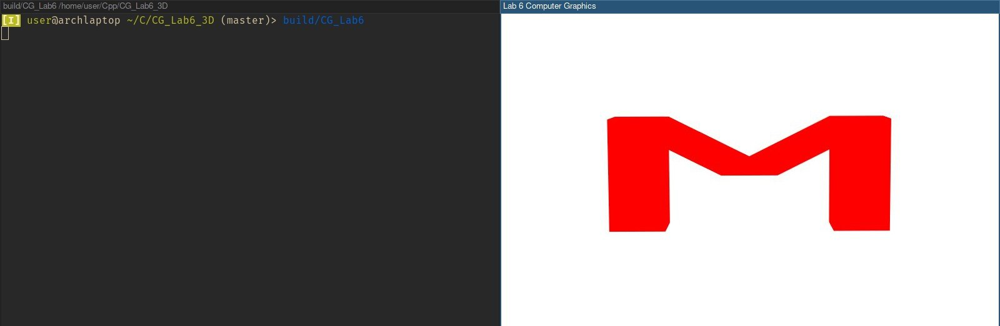
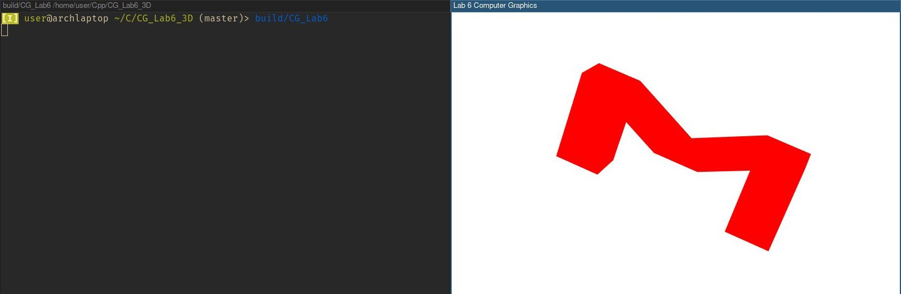
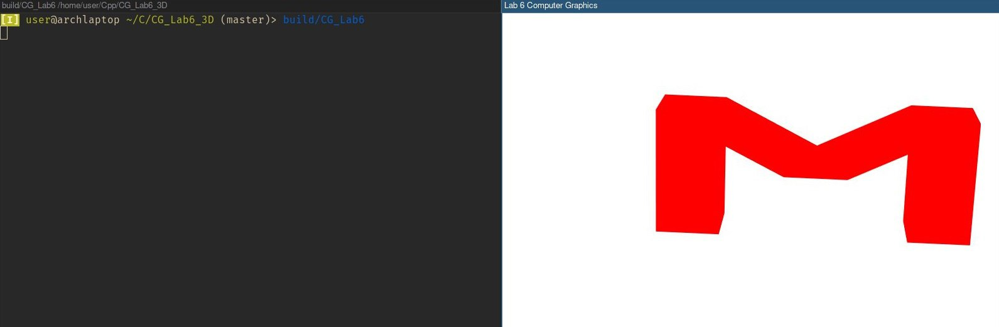

# Лабораторная работа №6. Построение и визуализация трехмерных объектов
Трехмерное изображение буквы "М".
## Пример использования
Управление масштабированием, переносом, вращением вокруг произвольной оси осуществляется мышью

